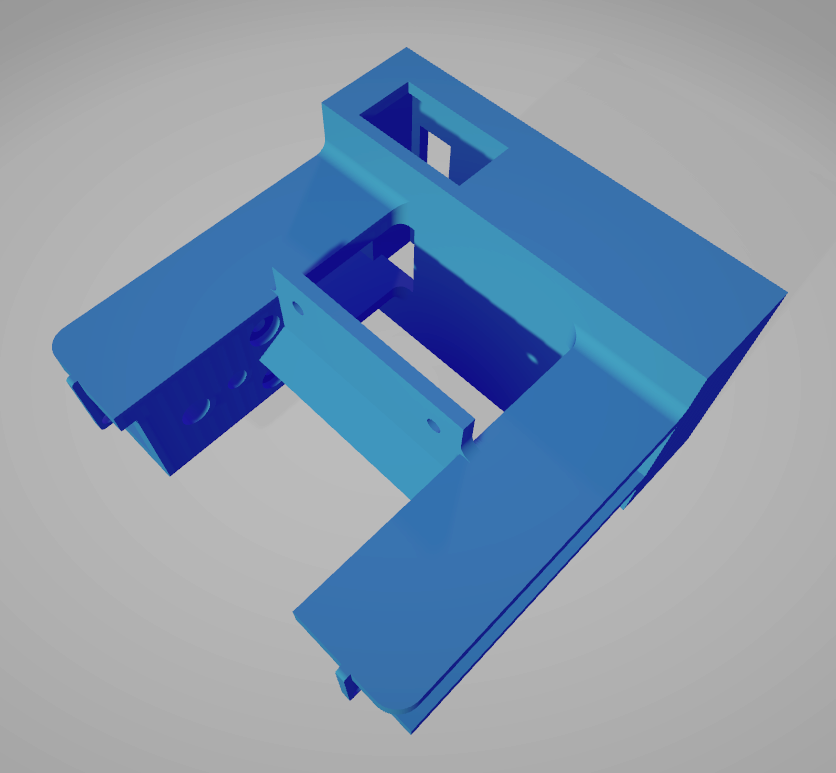
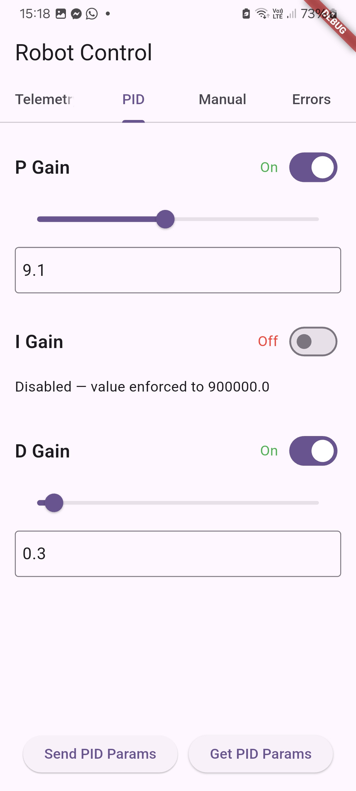
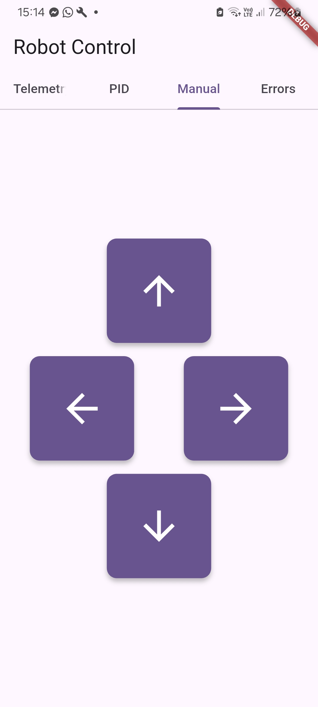
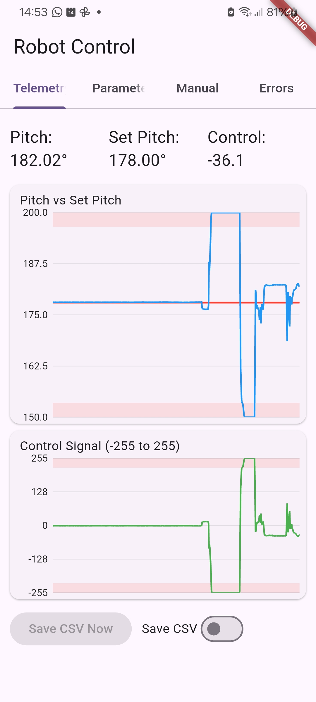
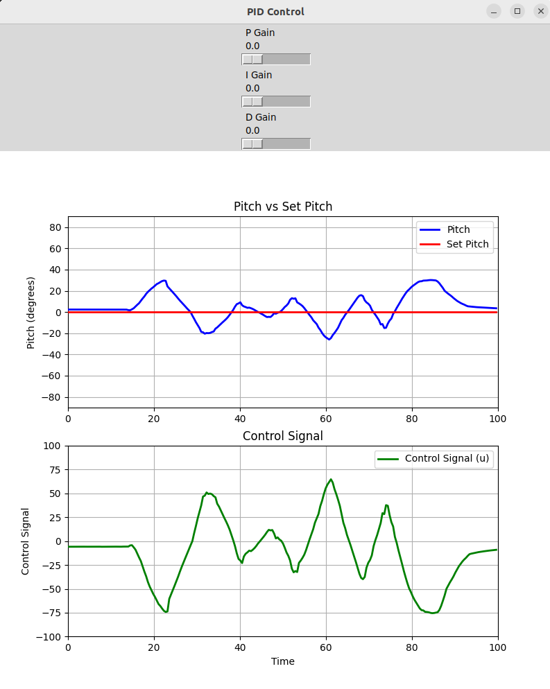
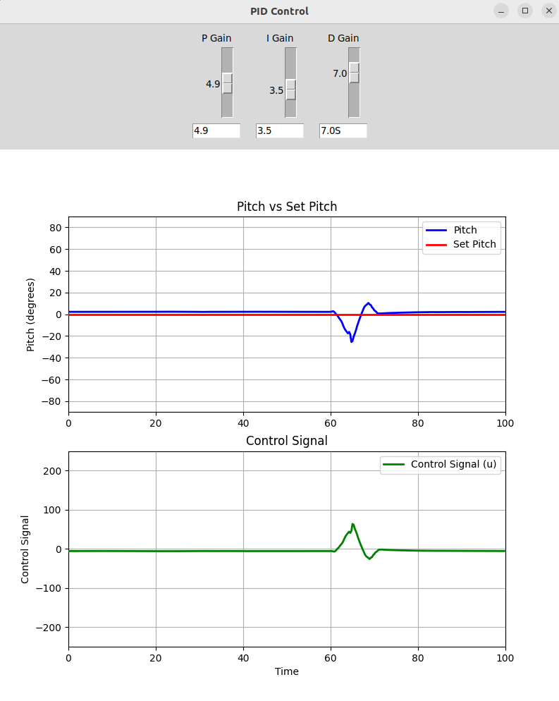
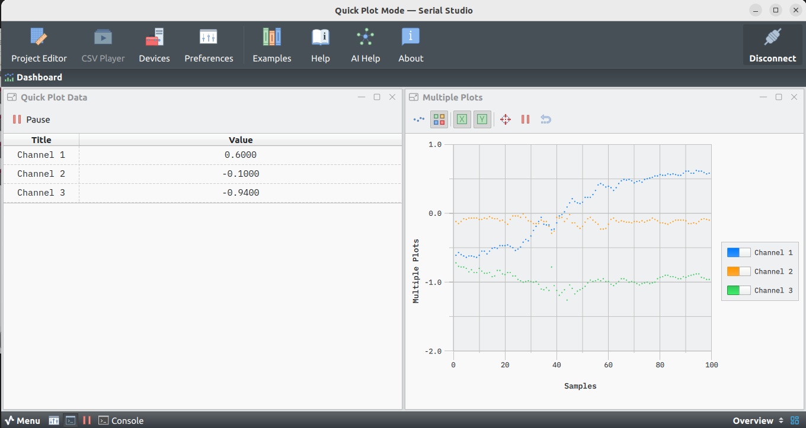
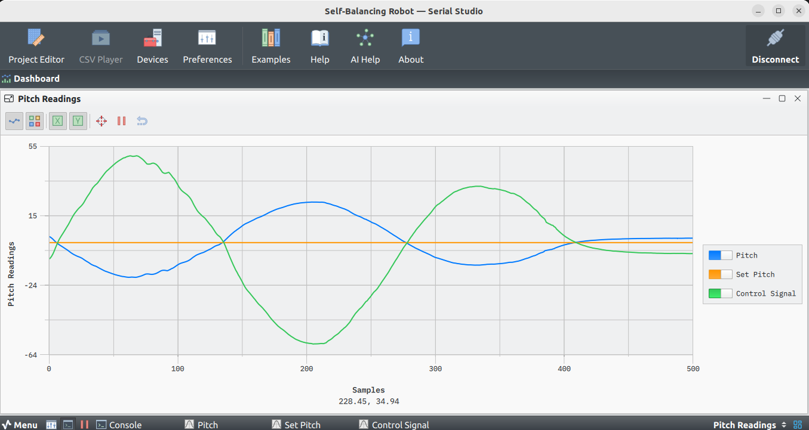

# Self-Balancing Robot

A two-wheel self-balancing robot project combining embedded systems firmware, control theory, a cross-platform mobile app, and data-visualisation tools.

---

## Table of Contents

- [Overview](#overview)
- [Hardware](#hardware)
- [Repository Structure](#repository-structure)
- [Firmware Variants](#firmware-variants)
  - [ESP32 - Arduino IDE (primary)](#esp32---arduino-ide-primary)
  - [ESP32 - ESP-IDF](#esp32---esp-idf)
  - [STM32](#stm32)
  - [Arduino IDE (original)](#arduino-ide-original)
- [Control Algorithm](#control-algorithm)
- [Mobile App](#mobile-app)
- [Visualisation Tools](#visualisation-tools)
- [Simulations](#simulations)
- [CAD Models](#cad-models)
- [Getting Started](#getting-started)
- [License](#license)

---

## Overview

The robot maintains vertical balance on two wheels using a real-time PID control loop running at 100 Hz. An MPU6050 IMU provides pitch-angle feedback via its built-in DMP. The controller outputs PWM signals to an L298N dual H-bridge motor driver. The primary firmware runs on an **ESP32** microcontroller and uses built-in WiFi for real-time telemetry and remote PID tuning.

---

## Hardware

| Component | Details |
|---|---|
| **Microcontroller** | ESP32 dual-core (primary) · STM32F103 (alternative) |
| **IMU** | MPU6050 – 6-axis accelerometer & gyroscope (I²C, DMP firmware) |
| **Motor Driver** | L298N dual-channel H-bridge |
| **Wireless** | Built-in WiFi (ESP32) · nRF24L01+ 2.4 GHz RF module (STM32) |
| **Motors** | DC geared motors with PWM speed control |

### Chassis



---

## Repository Structure

```
SelfBalancing-Robot/
├── esp32_s-b_r_fromArIDE/         # ESP32 firmware - Arduino IDE style (primary)
├── esp32_s-b_r/                   # ESP32 firmware - ESP-IDF / CMake
├── stm32_s-b_r/                   # STM32F1 firmware (CubeIDE)
├── stm32_s-b_r_t/                 # STM32F1 alternative / test build
├── self-balancing-robot_arduinoIDE/# Original Arduino IDE version
├── robot_control_app/             # Flutter cross-platform mobile app
├── Python_Plotting/               # Real-time UDP data visualisation
├── csv_py_plot/                   # CSV playback plotting
├── simulations/                   # MATLAB/Simulink models & analysis
├── CAD/                           # FreeCAD & STL 3D models
├── Pictures/                      # Project images
├── diagrams/                      # Architecture diagrams (Visual Paradigm)
└── Self-Balancing Robot.ssproj    # Serial Studio monitoring project
```

---

## Firmware Variants

### ESP32 - Arduino IDE (primary)

Located in `esp32_s-b_r_fromArIDE/`. This is the main firmware used in the project, built with the ESP-IDF toolchain (structured as an Arduino-IDE-friendly project).

**GPIO pin assignments:**

| Function | GPIO |
|---|---|
| I²C SDA (MPU6050) | 21 |
| I²C SCL (MPU6050) | 22 |
| MPU6050 DMP interrupt | 4 |
| Motor Left – Forward | 33 |
| Motor Left – Backward | 25 |
| Motor Right – Forward | 26 |
| Motor Right – Backward | 27 |

**Key features:**
- **Sensor:** MPU6050 with DMP firmware (42-byte FIFO packets, ~100 Hz pitch output)
- **Control loop:** `Balance_Control_task` at 10 ms (100 Hz), priority 10, pinned to core 1
- **Motor output:** LEDC PWM at 500 Hz, 14-bit resolution, with deadband compensation
- **WiFi:** Access-point mode (SSID `SBR_AP`, password `sbrpassword`)
- **Telemetry TX:** UDP port **7777** – `PITCH,SETPITCH,CONTROL_SIGNAL\n`
- **Command RX:** UDP port **7778** – live PID & movement commands
- **Startup safety:** waits for pitch to stabilise within ±3° of upright for 600 ms before enabling motors

**Build & flash:**
```bash
cd esp32_s-b_r_fromArIDE
idf.py set-target esp32
idf.py build
idf.py -p /dev/ttyUSB0 flash monitor
```

**Live PID tuning via UDP (port 7778):**
```
PID:Kp=9.0,1/Ti=0.0,Td=0.0,UPRIGHT=180.0,MIN_U=0.0
MOVE:FORWARD | BACKWARD | LEFT | RIGHT | STOP
```

---

### ESP32 - ESP-IDF

Located in `esp32_s-b_r/`. A more compact, monolithic implementation using the ESP-IDF CMake build system.

**Build:**
```bash
cd esp32_s-b_r
idf.py set-target esp32
idf.py build
idf.py flash monitor
```

---

### STM32

Located in `stm32_s-b_r/`. Built with STM32CubeIDE.

- **Control loop:** TIM3 interrupt at 100 Hz (10 ms period)
- **Sensor:** MPU6050 via I²C
- **Wireless:** nRF24L01+ via SPI – 4-byte payload (servo + motor ADC values)
- **Motor output:** PWM via TIM1 channels, with deadband compensation

**Build:** Open `stm32_s-b_r/` as an STM32CubeIDE project and build with the standard toolchain.

---

### Arduino IDE (original)

Located in `self-balancing-robot_arduinoIDE/`. Open the `.ino` sketch in the Arduino IDE and flash to a compatible board.

---

## Control Algorithm

### Pitch Estimation

The primary ESP32 firmware uses the **MPU6050 DMP** (Digital Motion Processor) to obtain pitch angle directly from the sensor's on-chip quaternion engine (~100 Hz, 42-byte FIFO packets). The pitch is expressed as 0–360°, where 180° represents the upright balanced position.

The STM32 variant uses a software **complementary filter**:
```
pitch = 0.95 × (pitch + gx × dt) + 0.05 × acc_pitch
```
- 95% weight on gyroscope integration (high-frequency accuracy)
- 5% weight on accelerometer angle (long-term drift correction)
- Accelerometer pitch: `atan2(ax, sqrt(ay² + az²))`

### Discrete PID Controller

```
K  = 2.5       (proportional gain)
Ti = 900 000   (integral time constant)
Td = 0.0       (derivative time constant – disabled)
Tp = 0.01 s    (sampling period, 10 ms)
```

Motor PWM output is clamped and a deadband of 22% is applied to overcome static friction.

---

## Mobile App

Located in `robot_control_app/`. Built with Flutter (SDK ≥ 3.7.2). Targets Android, iOS, Windows, Linux, macOS, and Web.

**Features:**
- Real-time pitch, set-pitch, and control-signal charts (custom `CustomPainter`)
- PID parameter sliders with live UDP updates to the robot
- Manual speed/direction control
- Data logging to CSV with export via `share_plus`

**Screenshots:**

| PID Tuning | Manual Control | Limits | Connection Status |
|---|---|---|---|
|  |  |  |  |

**Build & run:**
```bash
cd robot_control_app
flutter pub get
flutter run
```

---

## Visualisation Tools

### Python Real-Time Plotter

Located in `Python_Plotting/`. Receives UDP telemetry from the ESP32 and plots pitch, setpoint, and control signal in real time using `matplotlib`.

```bash
cd Python_Plotting
pip install matplotlib numpy
python dashboard.py
```




### Serial Studio

A pre-built Serial Studio project (`Self-Balancing Robot.ssproj`) parses the comma-separated telemetry stream and displays three datasets: Pitch, Set Pitch, and Control Signal.




### CSV Plotter

Located in `csv_py_plot/`. Replays recorded CSV data for offline analysis.

---

## Simulations

Located in `simulations/`. Requires MATLAB with Simulink.

| File | Description |
|---|---|
| `model.slx` | Continuous-time Simulink model |
| `Dyskretny_PID.mlx` | Discrete PID controller design |
| `transmitancja.mlx` | Transfer function analysis |
| `zigler_nichols.mlx` | Ziegler–Nichols tuning method |
| `Simple_G/robot_imitation.m` | Simplified robot dynamics simulation |

---

## CAD Models

Located in `CAD/`. Designed in FreeCAD.

| File | Description |
|---|---|
| `Chassy1.FCStd` | Full parametric chassis model |
| `Chassy1.stl` | Exportable mesh for 3D printing |

---

## Getting Started

1. **Clone the repository**
   ```bash
   git clone https://github.com/AntonyFFC/SelfBalancing-Robot.git
   cd SelfBalancing-Robot
   ```

2. **Flash the primary firmware** (ESP32 – Arduino IDE variant):
   ```bash
   cd esp32_s-b_r_fromArIDE
   idf.py set-target esp32
   idf.py build
   idf.py -p /dev/ttyUSB0 flash monitor
   ```
   See [Firmware Variants](#firmware-variants) for alternative builds.

3. **Connect to the robot's WiFi access point** (`SBR_AP` / `sbrpassword`).

4. **Run the mobile app or Python plotter** to monitor and tune the robot wirelessly.

5. *(Optional)* Open the MATLAB simulations to analyse the control system or experiment with different PID parameters.

---

## License

This project is provided as-is for educational purposes. See the repository for any applicable licence information.
